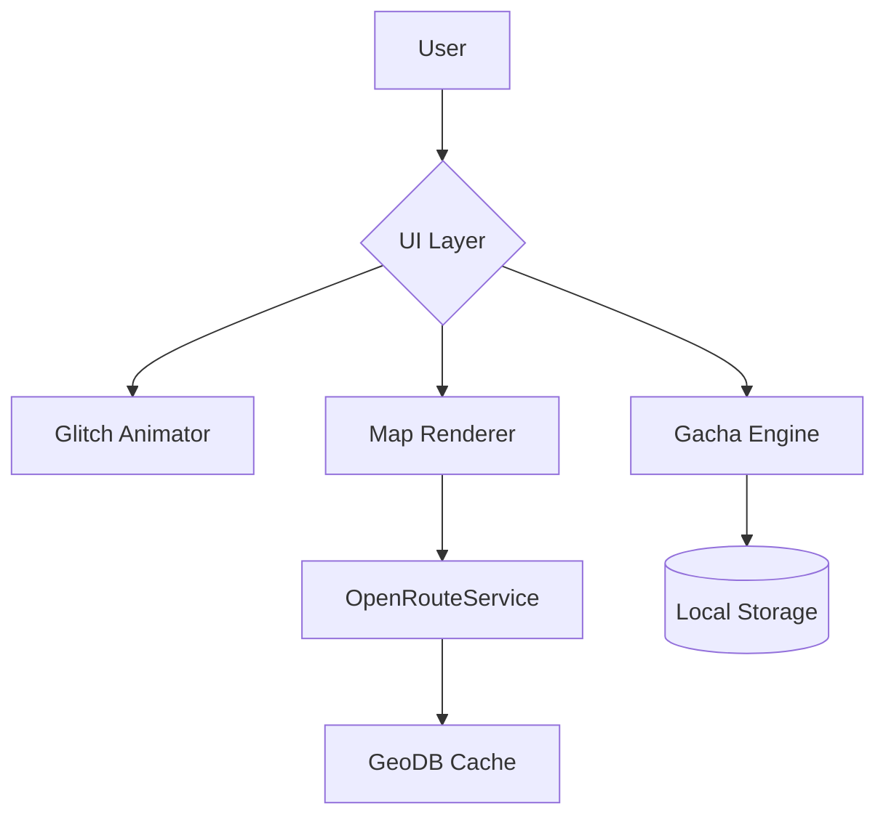

# Nature's Detour Navigation System


> **"Because getting lost is the new found!"**  
> An experimental navigation system combining retro terminal aesthetics with survival gacha mechanics.

## Table of Contents
- [Features](#features)
- [Quick Start](#quick-start)
- [System Architecture](#system-architecture)
- [Core Mechanics](#core-mechanics)
- [API Integration](#api-integration)
- [Testing & Safety](#testing--safety)
- [Disclaimer](#Disclaimer)
- [License](#license)

## Features

### 🎮 Core Functionality
- **Misleading Navigation Algorithm**  
  Deliberately ambiguous routing with poetic instructions
  ```javascript
  generateRoute(start, end, ambiguityLevel=0.7)
  ```
- **Survival Gacha System**  
  Collect 8 types of survival cards with 4 rarity tiers:
  - Common (90%): Torn Map Fragment, Squirrel's Blessing
  - Rare (9.9%): 30-min Compass, Water Purifier
  - Epic (0.09%): Fire Starter, Poisonous Berry
  - Legendary (0.01%): 1hr Local Guide, Rescue Helicopter

- **Dynamic Mapping**  
  Retro-styled map rendering with:
  ```css
  filter: grayscale(0.7) sepia(0.3);
  image-rendering: pixelated;
  ```

### 🖥️ UI Components
| Component | Description | Status |
|-----------|-------------|--------|
| CRT Filter | Scanline overlay effect | ✅ Stable |
| Glitch VFX | Random screen distortions | ✅ Stable |
| SOS Beacon | Emergency rescue button (¥299) | 🟡 Beta |
| Inventory | Sidebar + Modal views | ✅ Stable |

## Quick Start

1. **Get API Keys**
   ```bash
   # OpenRouteService API (Required)
   Visit https://openrouteservice.org/sign-up
   ```

2. **Configure Environment**
   ```javascript
   // script.js
   const ORS_API_KEY = 'your_api_key_here';
   const SANDBOX_MODE = true; // Disable for production
   ```

3. **Run Locally**
   ```bash
   npm install -g live-server
   live-server --port=5500 --browser=firefox
   ```

4. **Test Payment**  
   Use test card: `4242 4242 4242 4242`  
   Expiry: Any future date | CVV: 123

## System Architecture



## Core Mechanics

### 🎰 Gacha Probability Matrix
| Rarity | Base Rate | Pity System* |
|--------|-----------|--------------|
| Common | 90%       | -            |
| Rare   | 9.9%        | Every 20 pulls |
| Epic   | 0.09%      | Every 100 pulls |
| Legendary | 0.01%  | Guaranteed at 200 pulls |

*Pity counter resets after successful pull

### 🔄 Route Generation Logic
```python
def create_ambiguous_route(start, end):
    midpoint = calculate_midpoint(start, end)
    scenic_points = fetch_scenic_locations(midpoint)
    return random.choice(scenic_points) if scenic_points else midpoint
```

## API Integration

### Required Services
| Service | Usage | Rate Limit |
|---------|-------|------------|
| OpenRouteService | Route calculation | 50 req/day |
| Geoapify | Geocoding | 3000 req/day |
| Mockbin | Payment Sandbox | Unlimited |

### Endpoints
```javascript
// Geocoding Example
GET https://api.geoapify.com/v1/geocode/search?text=KCIS&apiKey=your_key

// Response
{
  "features": [
    {
      "geometry": {
        "coordinates": [31.2304, 121.4737]
      }
    }
  ]
}
```

## Testing & Safety

⚠️ **Critical Notice**  
All user data is stored in plaintext LocalStorage:
```javascript
// Sample storage structure
{
  "locationHistory": ["31.2304,121.4737", ...],
  "paymentCards": ["42424242", ...],
  "survivalCards": {"Compass": 3, ...}
}
```

🔒 **Recommended Security Practices**
```bash
Enable HTTPS for geolocation
openssl req -x509 -newkey rsa:4096 -nodes -keyout key.pem -out cert.pem -days 365
```

##Disclaimer
This project is a satirical commentary on:

Predatory mobile app practices
Over-reliance on navigation systems
Microtransaction culture
Not intended for actual navigation use. May cause existential crises.

##License
MIT License

Copyright © 2025 Nature's Detour

Permission is hereby granted...
